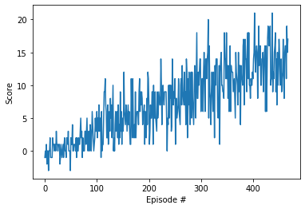

# Deep Reinforcement Learning Nanodegree
# *DRLND-Navigation*

## Report on the Implementation of the DQN-Agent

### Implementation

The environment and the DQN-agent are all implemented inside `Navigation.ipynb`. As chapter 1 - 3 were given from the project framework, chapter 4 contains all the implementation necessary to define, to train, and to run the DQN-agent. It consists of the following parts:

* 4.1 DQN-Model Definition
* 4.2 Agent Definition
* 4.3 Training the Agent
* 4.4 Run the Agent

The implementation and algorithms will be described in the following. Afterwards, results of the implementation and an outlook will be presented.

#### DQN-Model Definition

The DQN-model consists of three fully-connected layers where the first two layers have ReLU-activation functions and the third has a linear activation function.
The input dimension equals the `state_size` and the output dimension is the `action_size`. The dimensions of the two first hidden layers can be defined by `FC1_SIZE` and `FC2_SIZE` in the implementation block of chapter 4.2.

#### Agent Definition

Inside the agent, the methods of **Experience Replay** and **Fixed Q-Targets** are combined (plus the DQN-Model described above).    
For the **Experience Replay**, a class `ReplayBuffer` is implemented to store the (state, action, reward, next_state, done)-tuple. The buffer is integrated into the class `Agent`. The length of the buffer is defined by `BUFFER_SIZE`. The class owns the functions `add` to add a tuple to the memory and `sample` to create a batch of size `BATCH_SIZE` with elements of the replay memory.    
To work with **Fixed Q-Targets**, the class `Agent` initializes two DQN-models, one for the local development and one for the fixed target (over `UPDATE_EVERY` episodes). The class uses Adam optimization and to be defined parameters learning-rate `LR`, decay-rate `GAMMA`, and target-update rate `TAU`.    
The class `Agent` consists of the functions `step`, `act`, `learn`, and `soft_update`. The `soft_update` function updates the target parameters by itself and the local parameters by a `TAU`-defined ratio. The `learn` function calculates the mean-square error loss between the expected Q-value and current targets and uses it to optimize the DQN-model. It also takes care of the target parameter update (function `soft_update`). The function `act` determines the epsilon-greedy based action by passing the state through the DQN-network and choosing the result or randomly another action with the help of eps(silon). Finally, the `step` function stores the (state, action, reward, next_state, done)-tuple in the replay buffer and controls the learning in dependence of `UPDATE_EVERY` (call of function `learn`).

#### Training the Agent

The function `dqn` trains the agent. For `n_episodes`, it determines, as long as the episode holds, the action by calling `Agent.act(state, eps)`, gets the `env_info` from the environment containing the next_state, reward, and done and performs `agent.step()`. If the mean of the score window on 100 episodes reaches 13.0, the training will be stopped in advance and the model parameters will be saved.    
Before the function is called, an Agent has to be defined.

#### Run the Agent

In this block, the saved model parameters are loaded into the agent and the agent simulates one episode delivering a score as a result.

### Result

The DQN-model has been defined by the `state_size=37`, `action_size=4`, and number of neurons in the first and second hidden layer of 64 (`FC1_SIZE=64`, `FC2_SIZE=64`).    
The replay buffer consists of `BUFFER_SIZE=10000` buffers and generates samples of size `BATCH_SIZE=64`.    
The learning-rate is `LR=5e-4`, update relationship is `TAU=1e-3`, decay rate is `GAMMA=0.99`, and the target parameter are updated every fourth time step (`UPDATE_EVERY=4`).

With these settings, the average score of 13.01 could be reached after 368 episodes!

The single run got an even higher score of 17.0!

### Outlook

To become faster and grab more bananas, the replay buffer could be enhanced by the **Prioritized Experience Replay**. Choosing the more successful actions should lead to faster selection of bananas.    
As the argmax on the action values is used, the **Double DQNs** could help to improve the selection of the best action adding to the speed-up.    
**Dueling Networks** could help to reduce calculation time as the state values should not change much also adding to the speed-up.
